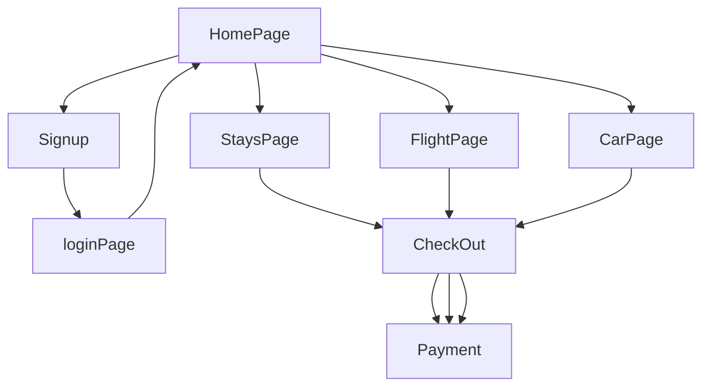

# WAY_TO_GLOBE

Way to glob is one of the online travel portal, offering travellers an extensive selection of hotels, activities and travel services to meet every budget and activities of every kind at competitive rates. 
With over hundreds of thousands of hotel partners and a comprehensive offering of flight inventory made available on the website, travellers can book everything they need for a holiday - rooms to meet every budget, activities of every kind and travel services to complement.  

## Installation

```
$ git clone https://github.com/Mohammadzaki0027/hurried-hospital-4011.git
```
```
$ cd hurried-hospital-4011
```


## Run Backend
```
$ cd Backend
$ npm install
$ npm run start
```

## Run Frontend
```
$ cd Frontend
$ npm install
$ npm run start
```

## Teck Stack

- React
- Redux
- NodeJS
- Chakra UI
- MongoDB
- Express
- JSON Web Tokens


## Flow



## Home Page

-  [Home Page]

This is home page with navbar and footer. This page has sliders, some links and some other 
sections. Here you can see demo products of bluemercury.com.


## 🔗 Collaborators Profile Links
| Collaborators  | Github  |  Linkedin   | Portfolio   |
| ---------- | -----------|------------|---------- |
| Mohammad zaki | [](#)  |  [ | [ |
| Priyanshu Tyagi | [](#)   
| Pallavi Kumari | [](#) | 
| Ajit Shelake | [](https://github.com/ashelake)| [](https://www.linkedin.com/in/ashelake/) | [](https://ashelake.github.io/) 
| Aditya Sharma | [](#)| 


## Deployed Link
 []

